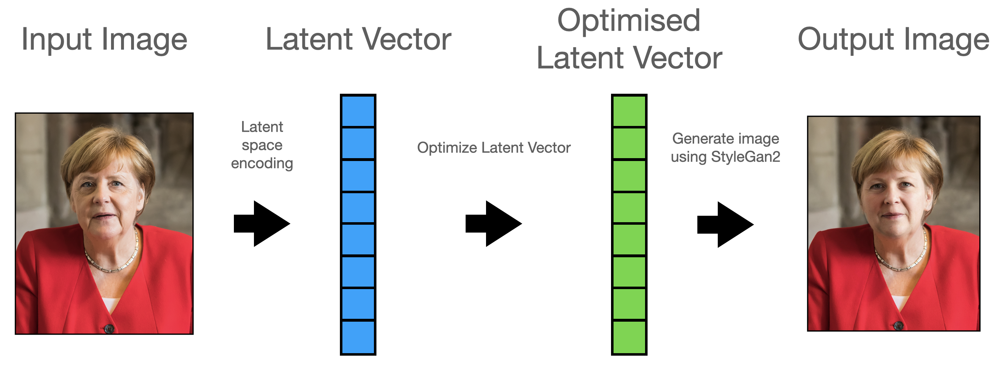

## How does it work?

### 1. Latent space encoding

First, the image is encoded into latent space. A latent vector is found that closely represents out input image. The encoder used is based on [StyleGan2 Encoder](https://github.com/robertluxemburg/stylegan2encoder.git).

### 2. Latent vector optimisation

Now to the fun part. Using a neural network that judges attractiveness of latent vectors, that face is optimized by the neural network. 

Using a gradient ascent approach, the latent vector is slightly changed in the direction of steepest ascent, meaning we "make our face pretty".

We'll get a new latent vector that generates a "prettier" version of the original face.

### 3. Generate output image

The new latent vector is now converted back into an image by StyleGan2. The generated image is then stiched back into the original image.

